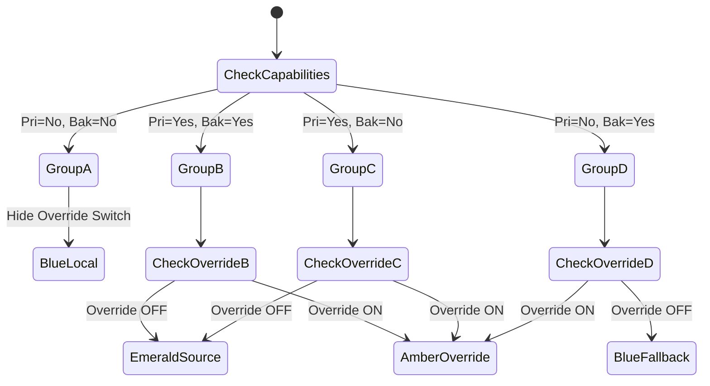

# Product Requirements Document (PRD)

## 1. Title

Iqamah Timing UI Decoupling & Source Capability Indicators

## 2. Introduction & Product Overview

The Azan Dashboard currently binds Iqamah timing configuration (e.g., offsets, rounding) inside the automated audio trigger cards. This obscures essential physical timing rules from users who do not wish to enable audio triggers. Additionally, it is unclear which prayer time providers natively supply Iqamah data (e.g., MyMasjid) versus those that require local calculation (e.g., Aladhan). This update extracts the Iqamah rules into a "Single Mosque Policy" UI component, clarifies source capabilities with visual badges, and provides safe batch-adjustment controls.

## 3. Goals and Objectives

- **Decouple Timing from Automation:** Elevate Iqamah calculation rules to a dedicated, always-visible UI component, separating physical timing policies from audio automation.
- **Enhance Transparency:** Clearly display whether a data source provides native Iqamah times using UI indicators.
- **Prevent Conflicting Configurations:** Implement a "Single Mosque Policy" where local calculations act as universal fallbacks, resolving Primary/Backup provider mismatches without duplicate data entry.
- **Streamline Batch Operations:** Allow users to safely apply a universal Iqamah offset to all prayers without destructively overriding active native provider connections.

## 4. Features and Requirements

- **[FEAT-001] Source Iqamah Indicator:** Update `SourceConfigurator.jsx` to display a badge/icon on provider selection buttons for providers where `capabilities.providesIqamah === true`, including an explanatory tooltip.
- **[FEAT-002] Decouple Iqamah Timing UI:** Remove the "Timing Logic" block from the "Iqamah" `TriggerCard` in `PrayerSettingsView.jsx`. Create a standalone `IqamahTimingCard.jsx` component and place it directly above the "Automation Sequence".
- **[FEAT-003] The "Single Mosque Policy" Architecture:**
  - The `IqamahTimingCard` must always display local calculation inputs (Offset, Rounding, Fixed Time).
  - The "Override Source Data" toggle must only render if _either_ the configured Primary or Backup source provides native Iqamah times.
- **[FEAT-004] Dynamic Status Banners:** The `IqamahTimingCard` must display a colour-coded informational banner summarising the exact runtime behaviour based on four distinct provider capability scenarios (detailed in Implementation Directives).
- **[FEAT-005] Batch Adjustments for Iqamah:** Extend the "Batch Adjustments" section in `AutomationGeneralTab.jsx` with an input for "Iqamah Offset". Clicking "Apply to All" must securely update numeric offsets across all prayers without toggling `iqamahOverride` switches ("Safe Mode").

## 5. Agent-Optimised Acceptance Criteria

- **AC-1 (Indicator):** In `SourceConfigurator.jsx`, buttons for providers with `providesIqamah: true` contain a `div` or `span` with text/icon indicating "Iqamah" and a `title` attribute for the tooltip.
- **AC-2 (UI Decoupling):** `client/src/views/settings/PrayerSettingsView.jsx` no longer passes `extraContent` to the Iqamah `TriggerCard`. Instead, `<IqamahTimingCard />` is rendered above the automation sequence.
- **AC-3 (Dynamic Banner - Group A):** If primary = `aladhan` and backup = `null`, the banner in `IqamahTimingCard` is visible, contains the string "Calculating Iqamah locally", uses `bg-blue-*` or similar blue Tailwind classes, and the Override switch is NOT in the DOM.
- **AC-4 (Dynamic Banner - Group B/C/D):** If primary = `mymasjid`, the Override switch IS in the DOM. If switch is OFF, the banner uses `bg-emerald-*` (green) classes and contains "Following source schedule". If ON, banner uses `bg-amber-*` (amber) classes and contains "Override Active".
- **AC-5 (Batch Update - Safe Mode):** In `AutomationGeneralTab.jsx`, submitting a batch Iqamah offset triggers a state update in `SettingsContext.jsx` that mutates `draftConfig.prayers[prayer].iqamahOffset` to the integer value, but strictly preserves the existing boolean state of `draftConfig.prayers[prayer].iqamahOverride`.
- **AC-6 (Batch Update Toast):** The toast notification string conditionally includes "overridden by your active" if `capabilities.providesIqamah === true` for the active source and `iqamahOverride === false`.

## 6. Technical Requirements

- **Frontend-Only Changes:** All logic must reside within the React client layer. Do not alter backend schemas, API payloads, or Express routers.
- **State Management:** Utilise the existing `useSettings` hook and `draftConfig` object to read and write configuration values seamlessly.
- **Component Structure:** The new `IqamahTimingCard.jsx` must accept the current prayer key (e.g., `'fajr'`), read from `draftConfig`, and update state via the `updateSetting` context method.
- **Context Expansion:** Add a new `bulkUpdateIqamahOffsets` method to `SettingsContext.jsx` alongside the existing `bulkUpdateOffsets`.

## 7. Custom Implementation & Output Directives

- **Dynamic Banner Text Mapping ([FEAT-004]):**
  - **Group A (Primary=No, Backup=No):** 🔵 "Calculating Iqamah locally. Your data source does not provide congregation times, so the rules below are actively being used."
  - **Group B (Primary=Yes, Backup=Yes):** 🟢 "Following source schedule. Currently tracking native Iqamah times from your Primary source. If a failover occurs, the Backup source's native times will be used." OR 🟠 "Override Active. Ignoring native Iqamah times from both your Primary and Backup sources. The local rules below are actively being used."
  - **Group C (Primary=Yes, Backup=No):** 🟢 "Following source schedule. Currently tracking native Iqamah times from your Primary source. If a failover occurs, the Backup source will use the local rules below." OR 🟠 "Override Active. Ignoring native Iqamah times from your Primary source. The local rules below are actively being used."
  - **Group D (Primary=No, Backup=Yes):** 🔵 "Calculating Iqamah locally. If the system fails over to your Backup source, it will switch to using its native Iqamah times." OR 🟠 "Calculating Iqamah locally. If a failover occurs, the Backup source's native times will be ignored in favour of these local rules."
- **Batch Update Notification:** Use `react-hot-toast` or the existing in-view notification state to present the Context-Aware Warning Notification as strictly defined during the interrogation phase.
- **British English Enforcement:** All internal code comments and UI strings must use British English (e.g., "synchronise", "colour", "behaviour").

## 8. Architectural Diagrams

## 9. Non-Functional Requirements

- **Accessibility (WCAG 2.1):** The new `IqamahTimingCard` collapsible section must use correct `aria-expanded` and `aria-controls` attributes. Tooltips must be accessible to screen readers.
- **Responsiveness:** The new batch update inputs and `IqamahTimingCard` must render cleanly on mobile viewports (stacking flexboxes where necessary).
- **Styling:** Leverage existing Tailwind CSS variables (e.g., `bg-app-card`, `border-app-border`, `text-app-dim`).

## 10. Security Analysis

- **Threat Model:** This feature deals exclusively with frontend UI rendering and draft configuration state. No new data transmission pathways are opened.
- **Mitigation:** `SettingsContext` already strips secrets and performs schema validation before saving. The new `bulkUpdateIqamahOffsets` method must safely clamp integers (min 0, max 60) to prevent malicious integer overflows before invoking `setDraftConfig`.

## 11. Release & Rollout Strategy

- This is a zero-downtime frontend deployment.
- No database or JSON configuration file migrations are required. The underlying schema in `local.json` (`prayers.<prayer>.iqamahOffset`, etc.) remains identical.

## 12. Final Self-Critique

- _Point of Failure 1:_ The `useProviders` hook might load asynchronously, meaning provider metadata isn't instantly available on page load.
  - _Mitigation:_ Use optional chaining and default to `providesIqamah: false` if provider metadata is undefined while loading to prevent unhandled UI exceptions.
- _Point of Failure 2:_ The batch update could inadvertently alter the `sunrise` prayer settings, which does not have Iqamah.
  - _Mitigation:_ The `bulkUpdateIqamahOffsets` method must strictly ignore the `sunrise` key during iteration.
- _Point of Failure 3:_ Conflicting conditional classes in the dynamic banner.
  - _Mitigation:_ Use the existing `cn()` utility (`clsx` + `tailwind-merge`) strictly for all dynamic class generation.

## 13. AI Coder Implementation Guidelines

- **Development Methodology:** Use Test-Driven Development (TDD). Create/update Vitest unit tests in `client/tests/unit/components/settings/IqamahTimingCard.test.jsx`.
- **Target Files:**
  1.  `client/src/components/settings/SourceConfigurator.jsx`
  2.  `client/src/components/settings/IqamahTimingCard.jsx` (Create new)
  3.  `client/src/views/settings/PrayerSettingsView.jsx`
  4.  `client/src/components/settings/automation/AutomationGeneralTab.jsx`
  5.  `client/src/contexts/SettingsContext.jsx`
- **Exploration Directive:** Use `grep` or standard search to review how `bulkUpdateOffsets` is currently implemented in `SettingsContext.jsx` to perfectly mimic its architectural pattern for the new `bulkUpdateIqamahOffsets` method.
- **Design Patterns:** Component composition (passing cleanly scoped props rather than heavy drilling). Context manipulation via encapsulated helper functions.
