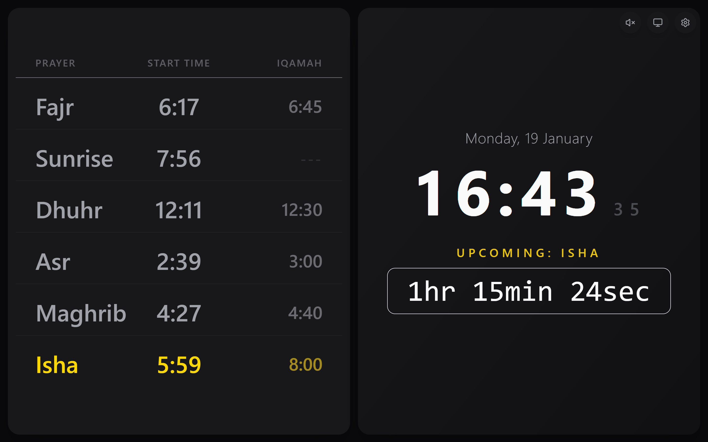

# Azan Dashboard



A comprehensive digital signage and automation solution designed for Mosques and Smart Homes. It acts as a central hub for Islamic prayer times, combining accurate calculations, congregation (Iqamah) management, and multi-room audio automation.

## 📖 Documentation

We have comprehensive documentation available for users, developers, and maintainers:

1.  [**Overview**](docs/01-overview.md) - Purpose, problem statement, and target audience.
2.  [**Features**](docs/02-features.md) - Deep dive into functionality, the settings panel, and automation capabilities.
3.  [**Setup & Installation**](docs/03-setup-installation.md) - Detailed prerequisites, environment config, and manual setup guides.
4.  [**Architecture**](docs/04-architecture.md) - Tech stack, backend patterns, and data flow diagrams.
5.  [**Automation Logic**](docs/05-automation-logic.md) - How the scheduler, TTS engine, and audio routing works.
6.  [**API Reference**](docs/06-api-reference.md) - Endpoints, authentication, and status codes.
7.  [**Operations & Deployment**](docs/07-ops-deployment.md) - Security hardening, health checks, and performance tuning.
8.  [**Development Guide**](docs/08-development-guide.md) - Contributing, testing strategy, and coding standards.
9.  [**Configuration Reference**](docs/09-configuration-reference.md) - Complete schema documentation with defaults and constraints.

---

## 🚀 Quick Start (Docker)

For detailed installation instructions, please see [Setup & Installation](docs/03-setup-installation.md).

The easiest way to deploy is using Docker. This packages the Node.js backend, React frontend, and Python TTS service into a single container.

### 1. Standard Setup (Windows, Mac, Docker Desktop)

Use this if you do not need the server to play audio out of its own physical speakers (e.g., you rely on Browser or Alexa audio).

```bash
docker compose -f docker/docker-compose.yml up -d
```

### 2. Linux Setup (Raspberry Pi / Server)

Use this if you want the application to play the Adhan directly through the device's 3.5mm jack or HDMI audio.

```bash
docker compose -f docker/docker-compose.yml -f docker/docker-compose.audio.yml up -d
```

**Access the Dashboard:** `http://localhost:3000`

---

## 📂 Persistence

The container will automatically create these folders in your project root to ensure data survives updates:

- `config/`: Stores `local.json` (settings) and `.env` (passwords/secrets).
- `data/`: Stores the prayer time cache.
- `public/audio/`: Stores custom MP3s and generated TTS cache.

## 🛠️ Tech Stack

- **Frontend:** React, Vite, Tailwind CSS
- **Backend:** Node.js, Express, file-based JSON cache
- **Microservice:** Python (FastAPI, Edge-TTS)
- **DevOps:** Docker, Supervisord
