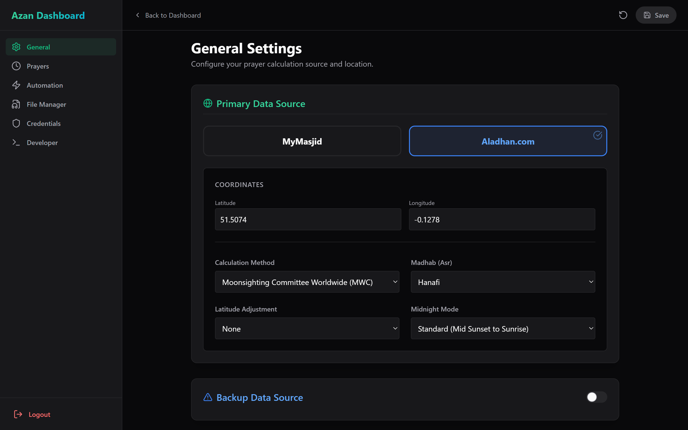
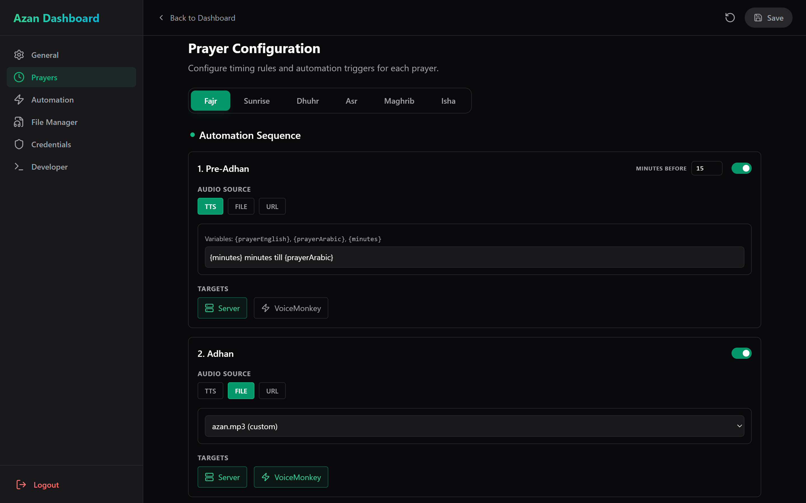
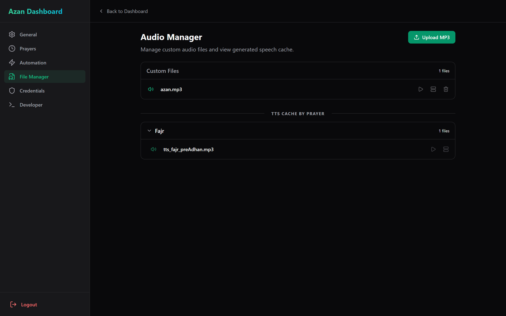

# 2. Features

## Core Functionality
*   **Multi-Source Data Retrieval:**
    *   **Aladhan API:** Calculates prayer times based on geolocation (Latitude/Longitude) with support for all major calculation methods (ISNA, MWL, Karachi, etc.) and Madhab settings.
    *   **MyMasjid API:** Fetches accurate, mosque-published timetables directly using a Masjid UUID.
    *   **Backup Failover:** Automatically switches to a secondary calculation method if the primary API (e.g., MyMasjid) goes offline.
*   **Advanced Timing Logic:**
    *   **Iqamah Calculation:** Supports dynamic offsets (e.g., "+15 mins") and fixed time overrides (e.g., "20:00").
    *   **Smart Rounding:** Automatically rounds calculated times to the nearest 5 or 10 minutes to match mosque conventions.
    *   **Sunrise Support:** Tracks Sunrise (Shuruq) as a distinct event for display and warnings.

## Key User-Facing Features
*   **Responsive Dashboard:**
    *   **Split View:** Displays a clear schedule on the left and a large "Focus Clock" with countdowns on the right.
    *   **Client Customisation:** Each connected browser can configure its own theme (Dark/Light), clock format (12h/24h), and local mute settings.
*   **Administration Panel:**
    *   **Secure Access:** Password-protected settings area.
    *   **File Manager:** Upload custom MP3s (Adhans) or manage generated TTS assets.
    *   **Developer Tools:** View live system logs, active scheduler jobs, and system health diagnostics.
*   **Audio Automation:**
    *   **Triggers:** Configure events for Pre-Adhan (Reminders), Adhan, Pre-Iqamah, and Iqamah.
    *   **Text-to-Speech (TTS):** Integrated Python microservice generating high-quality neural speech in English and Arabic.
    *   **Targets:** Route audio to:
        *   **Local:** The server's physical audio output (3.5mm/HDMI).
        *   **Browser:** All connected dashboard clients.
        *   **VoiceMonkey:** External Alexa/Smart Home devices.

### Kiosk Mode & System Logic
*   **Purpose:** Provides control over browser-level system behaviours, grouped in the **Display Settings → System** tab.
*   **Focus Logic:** 
    *   **Skip Sunrise:** Use "Target Dhuhr after Fajr" to remove Sunrise from the main dashboard countdown.
*   **Screen Wake Lock:** 
    *   Prevents the display device from sleeping, ideal for TV screens and dedicated tablets.
    *   Use the Power icon on the dashboard overlay for session-level control.
    *   Enable "Auto-enable Wake Lock" in settings to activate automatically on page load.
*   **Auto-unmute:** 
    *   Attempts to resume the browser's `AudioContext` automatically on page load.
    *   If blocked by browser policy, a pulsing red icon appears with the tooltip "Auto-play blocked. Click to enable."
    *   A single click on the icon resolves the block for the session.
*   **Requirements:** Most system logic (Wake Lock, Auto-unmute) requires a secure context (HTTPS or localhost).

### Settings Interface
The administration panel provides granular control over the system:

**General Settings** (Source Selection & Location):

**Automation Settings** (Global Switches & Triggers):

**File Manager** (Asset Management):

## Non-Functional Features
*   **Resilience:**
    *   **Local Caching:** Fetches and stores the entire year's schedule. The system continues to function for months without internet access.
    *   **Configuration Safety:** Validates all settings changes before saving to prevent system crashes.
*   **Performance:**
    *   **Server-Sent Events (SSE):** Push-based updates for clock synchronisation, logs, and audio triggers (no polling lag).
    *   **Debouncing:** Prevents duplicate audio triggers and API spamming.
*   **Security:**
    *   **Rate Limiting:** Protects login and operational endpoints from abuse.
    *   **Authentication:** HttpOnly Cookies and JWT for secure session management.
    *   **Secret Management:** Sensitive tokens (VoiceMonkey) are stored in environment variables, not config files.