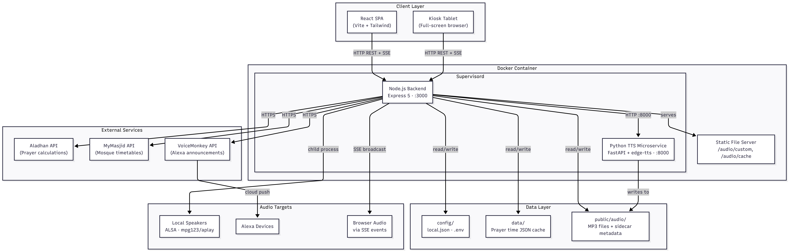

# 4. Project Architecture

## Technology Stack

The Azan Dashboard is built on a modern, polyglot stack designed for reliability and ease of deployment.

### Backend
*   **Runtime:** Node.js (v22+)
*   **Framework:** Express.js (REST API & Static File Serving)
*   **Scheduling:** `node-schedule` for precise job execution.
*   **Audio Processing:** `play-sound` (wrapper for `mpg123`) and `edge-tts`.
*   **Validation:** `zod` for strict runtime schema validation.

### Frontend
*   **Framework:** React 18
*   **Build Tool:** Vite
*   **Styling:** Tailwind CSS (Utility-first framework)
*   **State Management:** React Context API (`AuthContext`, `SettingsContext`, `ClientPreferencesContext`).
*   **Real-time Communication:** Server-Sent Events (SSE) for logs and audio triggers.

### Microservices
*   **TTS Service:** Python 3.11+ using `FastAPI` and `uvicorn`. Wraps the `edge-tts` library to generate neural speech audio files.

### Storage
*   **Configuration:** File-based JSON (`config/local.json`) with environment variable overrides.
*   **Data Cache:** File-based JSON (`data/cache.json`) for prayer times.
*   **Assets:** Local file system (`public/audio/`) for custom MP3s and generated TTS cache.

## Backend Architecture
The backend follows a strict **Controller-Service-Route** pattern to separate concerns and ensure maintainability.

### 1. Route Layer (`src/routes/`)
Defines the HTTP endpoints and applies middleware.
*   **Middleware:** Rate limiting, Authentication (`verifyToken`), Error Handling, and File Upload constraints (`multer`).
*   **Responsibility:** Receives the request, validates inputs, and delegates to the Controller.

### 2. Controller Layer (`src/controllers/`)
Orchestrates the business logic flow.
*   **Responsibility:** Calls necessary Services, formats the HTTP response, and handles high-level errors. It does *not* contain core business logic (e.g., calculation algorithms).

### 3. Service Layer (`src/services/`)
Contains the core business logic and reusable functions, now organised into sub-domains:

#### Core Services (`src/services/core/`)
*   `prayerTimeService.js`: Fetches data, applies offsets, and writes to cache.
*   `schedulerService.js`: Manages `node-schedule` jobs and hot-reloading.
*   `automationService.js`: Handles trigger execution and audio routing.

#### System Services (`src/services/system/`)
*   `audioAssetService.js`: Manages TTS generation and file cleanup.
*   `storageService.js`: Handles storage quota and cleanup operations.
*   `healthCheck.js`: Monitors service health status.
*   `diagnosticsService.js`: Provides diagnostic information.
*   `sseService.js`: Manages Server-Sent Events connections.

### 4. Adapter Layer (`src/adapters/`)
Handles all external API integrations and data transformation.
*   `prayerApiAdapter.js`: Fetches prayer time data from Aladhan and MyMasjid APIs, validates responses with Zod schemas, and transforms data into a standardised format.
*   **Responsibility:** Isolates external dependencies from business logic. If an API changes, only the adapter needs updating.

## Frontend Architecture
The frontend is a Single Page Application (SPA) designed for resilience.

*   **View Layer:** Divided into `DashboardView` (Display) and `SettingsView` (Administration).
*   **Context Providers:**
    *   `AuthContext`: Manages login state and setup requirements.
    *   `SettingsContext`: Manages configuration fetching, "dirty" state tracking, and validation.
    *   `ClientPreferencesContext`: Persists device-specific settings (Dark mode, Mute state) to `localStorage`.
*   **Component Strategy:** Uses modular components (e.g., `FocusCard`, `TriggerCard`) to ensure UI consistency.

## Data Layer & Persistence
The system prioritises file-based persistence for portability (easier to back up/restore via Docker volumes).

### Configuration Hierarchy
The `ConfigService` singleton loads settings in the following priority order (highest wins):
1.  **Environment Variables:** Secrets (`VOICEMONKEY_TOKEN`) and infrastructure settings (`PORT`).
2.  **Local Override (`config/local.json`):** User-defined settings via the UI.
3.  **Default Config (`config/default.json`):** Hardcoded fallbacks committed to the repository.

### Data Caching
Prayer times are fetched annually (Aladhan) or in bulk (MyMasjid) and stored in `data/cache.json`.
*   **Structure:** A map keyed by ISO Date (`YYYY-MM-DD`).
*   **Logic:** The system checks the cache first. If data is missing or stale, it fetches from the external API. This ensures the dashboard works offline once hydrated.