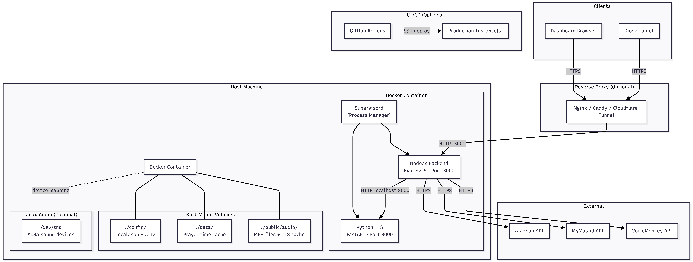
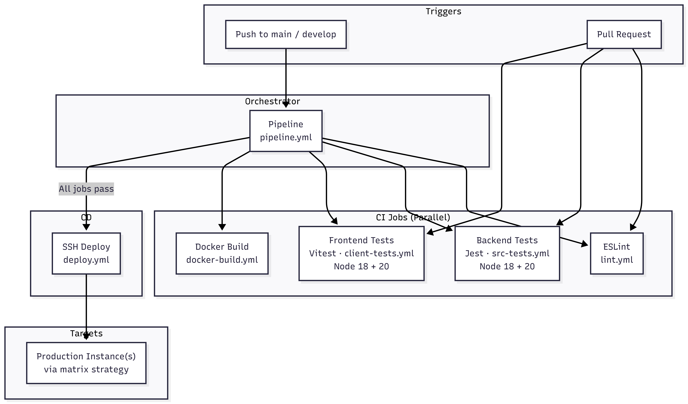
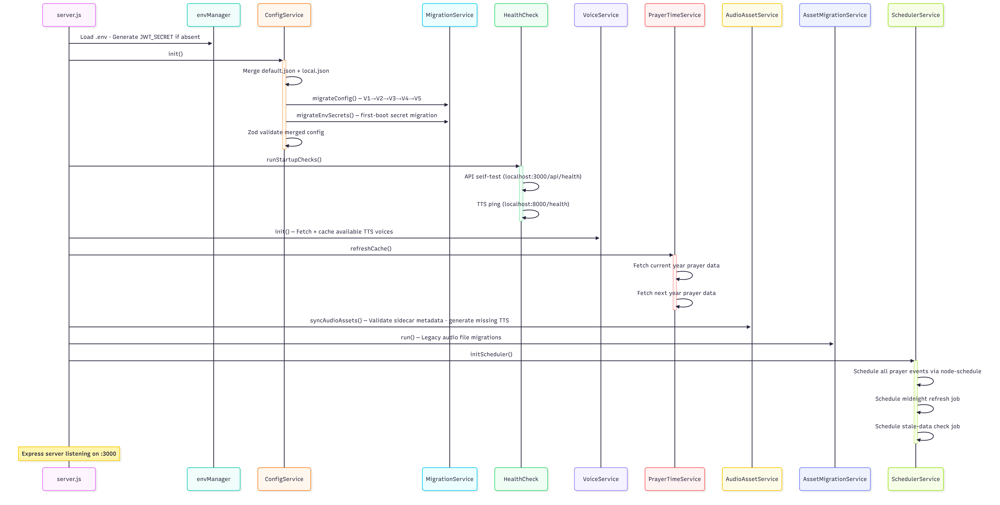

# 7. Operations and Deployment

This document covers the operational aspects of running the Azan Dashboard in production, including deployment architecture, security hardening, CI/CD pipeline, monitoring, and performance tuning.

---

## Deployment Architecture

The recommended deployment is a single Docker container hosting all three components — Node.js backend, React static assets, and Python TTS microservice — managed by **Supervisord**. This simplifies network configuration and shared file access.



### Container Process Model

Supervisord orchestrates two processes within the container:

| Process      | Command              | Role                                        |
| ------------ | -------------------- | ------------------------------------------- |
| `node-app`   | `node src/server.js` | Express backend + serves React static build |
| `python-tts` | `uvicorn server:app` | FastAPI TTS microservice on port 8000       |

Both processes are configured with `autorestart=true`. If either crashes, Supervisord restarts it automatically.

### Volume Strategy

To ensure data persistence across container rebuilds, the following paths **must** be mapped to the host:

| Container Path              | Purpose                          | Content                                   |
| --------------------------- | -------------------------------- | ----------------------------------------- |
| `/app/config/`              | Configuration files              | `local.json` (settings), `.env` (secrets) |
| `/app/data/`                | Prayer time cache                | `cache.json`                              |
| `/app/public/audio/custom/` | User-uploaded custom audio files | MP3/WAV/AAC/OGG/OPUS/FLAC/M4A files       |
| `/app/public/audio/cache/`  | Generated TTS audio cache        | Auto-generated audio + sidecar JSON       |

> **Note:** The `.env` file resides inside the `config/` directory in the container (`/app/config/.env`), enabling a single volume mapping for all configuration data.

### Hardware Access (Local Audio)

For the system to play audio through the host's physical speakers (e.g., a Raspberry Pi connected to a mosque PA system), the container requires access to the ALSA sound device.

| Setting         | Value                                                                                                      |
| --------------- | ---------------------------------------------------------------------------------------------------------- |
| Docker flag     | `--device /dev/snd`                                                                                        |
| Compose overlay | `docker/docker-compose.audio.yml`                                                                          |
| Constraint      | Linux hosts only (ALSA). Docker Desktop on Windows/macOS does not support hardware pass-through for audio. |

**Standard setup** (no local audio):

```bash
docker compose -f docker/docker-compose.yml up -d
```

**Linux setup** (local audio enabled):

```bash
docker compose -f docker/docker-compose.yml -f docker/docker-compose.audio.yml up -d
```

---

## Reverse Proxy Configuration

When deploying behind a reverse proxy, two critical configurations must be applied:

1. **Upload limits** — Increase the body size limit to allow MP3 uploads (the application enforces a 10 MB internal limit, but most proxies default to 1 MB).
2. **SSE buffering** — Disable response buffering for the `/api/logs` endpoint to enable real-time log streaming.

### Nginx

```nginx
server {
    # ... existing server_name and listen configuration ...

    # REQUIRED: Allow larger uploads for audio files
    client_max_body_size 20M;

    # Handle Server-Sent Events (SSE) for logs
    location /api/logs {
        proxy_pass http://localhost:3000;

        # CRITICAL: Disable buffering so data is sent immediately
        proxy_buffering off;
        proxy_cache off;

        # Connection settings required for SSE
        proxy_set_header Connection '';
        proxy_http_version 1.1;
        chunked_transfer_encoding off;

        # Prevent Nginx from timing out the idle connection (24 hours)
        proxy_read_timeout 24h;

        # Standard headers
        proxy_set_header Host $host;
        proxy_set_header X-Real-IP $remote_addr;
        proxy_set_header X-Forwarded-For $proxy_add_x_forwarded_for;
        proxy_set_header X-Forwarded-Proto $scheme;
    }

    # Standard traffic
    location / {
        proxy_pass http://localhost:3000;
        proxy_http_version 1.1;
        proxy_set_header Upgrade $http_upgrade;
        proxy_set_header Connection 'upgrade';
        proxy_set_header Host $host;
        proxy_cache_bypass $http_upgrade;
    }
}
```

> **Important:** Set `client_max_body_size` to at least **20M**. Nginx rejects files larger than 1 MB by default with a `413 Request Entity Too Large` error, even though the application's internal limit is 10 MB.

### Apache

Ensure `mod_proxy` is configured with `flushpackets=on` for the `/api/logs` path, or set the `no-gzip` and `proxy-nokeepalive` environment variables.

### Caddy

Caddy generally handles streaming well. If SSE issues arise, set `flush_interval` to `-1` for the logs path.

### Cloudflare

Cloudflare buffers responses by default. Create a **Page Rule** for `yourdomain.com/api/logs*` with **Cache Level** set to **Bypass**.

---

## Security

### 1. Authentication

| Aspect               | Implementation                                                                                                                                                                  |
| -------------------- | ------------------------------------------------------------------------------------------------------------------------------------------------------------------------------- |
| **Password Hashing** | `scrypt` (N=16384, r=8, p=1) with a random salt.                                                                                                                                |
| **JWT Signing**      | HMAC with a persistent 64-byte secret stored in `.env` (`JWT_SECRET`).                                                                                                          |
| **Token Versioning** | Each JWT contains a `tokenVersion` claim checked on every request. Changing the admin password increments the server's version, immediately invalidating all existing sessions. |
| **Cookie Flags**     | `HttpOnly`, `SameSite=Strict`, `Secure` (production). Prevents XSS and CSRF attacks.                                                                                            |
| **Session Duration** | 24 hours. No refresh token mechanism — the user must re-authenticate after expiry.                                                                                              |

> **Upgrade Notice:** Deploying token versioning for the first time causes a one-time logout for all active users, as existing tokens lack the `tokenVersion` field.

### 2. Rate Limiting

The API implements five tiered rate limiters using `express-rate-limit`:

| Tier             | Window     | Max Requests | Purpose                                                   |
| ---------------- | ---------- | ------------ | --------------------------------------------------------- |
| **Security**     | 1 minute   | 20           | Blocks brute-force login attempts.                        |
| **Operations**   | 10 seconds | 10           | Prevents abuse of resource-heavy actions (TTS, uploads).  |
| **Global Read**  | 10 seconds | 50           | Allows multiple dashboard screens to poll simultaneously. |
| **Global Write** | 10 seconds | 10           | Limits configuration changes and mutations.               |
| **SSE**          | 1 minute   | 50           | Limits new SSE connection creation rate.                  |

All limiters are bypassed during automated testing (`NODE_ENV=test`) unless `FORCE_RATE_LIMIT` is set.

Rate-limited responses return `429 Too Many Requests` with `Retry-After` headers and a descriptive JSON message. Violations are logged to both the console and the SSE stream.

### 3. Input Validation

All configuration updates are validated against strict **Zod schemas** before being persisted:

- **Type coercion** — Prevents injection of invalid data types.
- **Range enforcement** — Iqamah offsets are bounded (0–60 minutes), coordinates bounded (±90 latitude, ±180 longitude).
- **Timezone validation** — Verified against `Intl.DateTimeFormat`.
- **Template length** — TTS templates capped at the configured maximum (50 characters by default).
- **Environment variable whitelist** — Only keys matching explicit patterns (`*_KEY`, `*_TOKEN`, `*_URL`, etc.) are permitted. System-critical variables (`PATH`, `NODE_OPTIONS`, `LD_PRELOAD`) are blacklisted.

### 4. File Upload Security

| Check                     | Implementation                                                                                        |
| ------------------------- | ----------------------------------------------------------------------------------------------------- |
| **Extension filter**      | Only `.mp3`, `.wav`, `.aac`, `.ogg`, `.opus`, `.flac`, `.m4a` accepted.                               |
| **MIME type check**       | Must start with `audio/`.                                                                             |
| **Magic bytes**           | File content is validated via `audioValidator.analyseAudioFile()` after upload.                       |
| **Size limit**            | 10 MB maximum enforced by Multer.                                                                     |
| **File count limit**      | Maximum 500 custom files.                                                                             |
| **Filename sanitisation** | Non-alphanumeric characters (except `.`) replaced with `_`. Path traversal (`..`, `/`, `\`) rejected. |
| **Storage quota**         | `storageCheck` middleware rejects uploads when disk quota is exceeded.                                |
| **Protected files**       | Metadata sidecar can mark files as `protected: true`, preventing deletion.                            |

### 5. DNS Rebinding Protection

The `POST /api/system/validate-url` endpoint uses pinned DNS agents from `networkUtils.js`. DNS resolution is performed once at connection time and reused, preventing an attacker from returning a malicious IP on subsequent DNS lookups.

### 6. Wake Lock API (HTTPS Requirement)

The Screen Wake Lock API — used to keep kiosk displays active — **only functions over HTTPS** (or `localhost`). If the dashboard is served over plain HTTP, the "Keep Screen On" feature will be unavailable.

### 7. Encryption at Rest

Sensitive configuration values (output API keys, provider credentials) are encrypted using AES before being written to `local.json`. The encryption salt is stored in `.env` (`ENCRYPTION_SALT`) and auto-generated during initial setup.

---

## CI/CD Pipeline

The project includes **GitHub Actions** workflows for continuous integration and deployment. The pipeline is triggered on pushes to `main` and on pull requests.



### Pipeline Stages

```
Push to main
     │
     ├── Lint ──────────────┐
     ├── Backend Tests ─────┤ (parallel)
     └── Frontend Tests ────┘
              │
         Docker Build
              │
         Deployment
```

| Stage              | Workflow File      | Trigger                               | Description                                                                 |
| ------------------ | ------------------ | ------------------------------------- | --------------------------------------------------------------------------- |
| **Lint**           | `lint.yml`         | Push to `main`, PR to `main`          | ESLint on Node.js 22.                                                       |
| **Backend Tests**  | `src-tests.yml`    | Push to `main`, PR to `main`          | Jest (`npm run test:src`).                                                  |
| **Frontend Tests** | `client-tests.yml` | Push to `main`, PR to `main`          | Vitest (`npm run test:client`).                                             |
| **Docker Build**   | `docker-build.yml` | After lint + tests pass, PR to `main` | Docker Buildx with GitHub Actions cache. Build verification only (no push). |
| **Deployment**     | `deploy.yml`       | After Docker build, manual dispatch   | SSH deployment to production instance(s).                                   |

### Orchestration

The `pipeline.yml` workflow orchestrates the full sequence:

1. **Lint**, **Backend Tests**, and **Frontend Tests** run in parallel.
2. **Docker Build** runs only after all three pass.
3. **Deployment** runs only after the Docker build succeeds.

### Deployment Strategy

The deployment workflow supports a **matrix strategy** for deploying to one or more instances simultaneously via SSH. Each deployment performs the following steps:

1. Fetch and hard-reset to `origin/main`.
2. Inject environment variables (`APP_PORT`, `COMPOSE_PROJECT_NAME`, `BASE_URL`).
3. Rebuild and restart Docker containers (with audio overlay if applicable).
4. Prune unused Docker images.
5. Reload the reverse proxy.

To add your own deployment targets, configure the matrix in `deploy.yml` with your host addresses, ports, and SSH credentials (stored as GitHub Secrets).

---

## Monitoring and Logging

### Real-Time Log Stream

The system broadcasts internal logs to the frontend via **Server-Sent Events** on `GET /api/logs`. This provides real-time visibility into:

- Scheduler trigger events (e.g., "Triggering Fajr Adhan…").
- Error messages (e.g., "VoiceMonkey API unreachable").
- Rate limit violations with client IP and endpoint.
- TTS generation progress updates.

The SSE stream emits three event types:

| Event            | Purpose                                                 |
| ---------------- | ------------------------------------------------------- |
| `LOG`            | General system log messages with level and timestamp.   |
| `AUDIO_PLAY`     | Signal to browser clients to play a specific audio URL. |
| `PROCESS_UPDATE` | Progress updates during long-running operations.        |

### Health Checks

The `GET /api/system/health` endpoint provides a JSON status of critical subsystems:

| Component          | What It Checks                                                              |
| ------------------ | --------------------------------------------------------------------------- |
| **Local Audio**    | Whether `mpg123` is installed and `/dev/snd` is accessible.                 |
| **TTS Service**    | Pings the Python FastAPI microservice on port 8000.                         |
| **Primary Source** | Verifies connectivity to the configured primary prayer API (e.g., Aladhan). |
| **Backup Source**  | Verifies connectivity to the backup prayer API (if configured).             |

Individual health checks can be toggled on or off via `POST /api/system/health/toggle` without restarting the server.

### Docker Health Probe

The lightweight `GET /api/health` endpoint (outside the API router) returns `{ "status": "ok" }` and is suitable for Docker `HEALTHCHECK` directives and load balancer probes.

### Backend Logging

The backend uses **Winston** (`@utils/logger`) for structured logging. Direct `console.log` usage is discouraged in favour of the logger, which supports:

- Multiple transport targets.
- Log level filtering.
- Structured JSON output for production environments.

---

## Performance Considerations

### Caching Strategy

| Layer               | Strategy                                                                                                                                                                                                  |
| ------------------- | --------------------------------------------------------------------------------------------------------------------------------------------------------------------------------------------------------- |
| **Prayer Data**     | Fetched once per year (Aladhan) or in bulk (MyMasjid) and cached to `data/cache.json`. Eliminates daily API latency. Stale data detection triggers automatic refresh after a configurable number of days. |
| **Audio Assets**    | TTS files are generated once and reused until the template text or voice changes. The system uses file metadata to manage the cache.                                                                      |
| **Audio File List** | In-memory cache with a 60-second TTL. File metadata is pre-loaded and paginated from cache.                                                                                                               |
| **Voice List**      | TTS voice catalogue is cached in-memory by `voiceService` after initial fetch from the Python microservice.                                                                                               |
| **API Responses**   | All `/api/*` responses include `no-cache` headers to prevent stale data on kiosk displays.                                                                                                                |

### Debouncing and Deduplication

| Mechanism                  | Description                                                                                                                                                  |
| -------------------------- | ------------------------------------------------------------------------------------------------------------------------------------------------------------ |
| **Automation triggers**    | Each event (e.g., Fajr Adhan) triggers only once per day, preventing double-playback if the scheduler re-evaluates.                                          |
| **Frontend polling**       | The dashboard polls for status updates every 10 seconds but immediately backs off upon receiving a `429 Too Many Requests` response.                         |
| **File system operations** | `systemController` uses **Bottleneck** to limit concurrent file system operations to 50, preventing EMFILE errors and memory spikes during audio file scans. |

### Resource Constraints

| Resource       | Limit                                                  |
| -------------- | ------------------------------------------------------ |
| Upload size    | 10 MB per file (Multer).                               |
| File count     | 500 custom audio files maximum.                        |
| Storage quota  | Configurable (default 1.0 GB), checked before uploads. |
| TTS template   | 50 characters maximum.                                 |
| URL validation | 5-second timeout, 5 MB max response size.              |

### Startup Sequence

The server startup order in `server.js` is **load-bearing** — changing the sequence may break inter-service assumptions:

```
1. Environment variables (.env loaded)
2. Configuration (ConfigService initialised, Zod validation)
3. Health checks (initial system probe)
4. Voice service (TTS voice list cached)
5. Prayer cache refresh (annual data fetched if stale)
6. Audio asset synchronisation (TTS files generated)
7. Configuration migration (schema version upgrades)
8. Scheduler initialisation (prayer event jobs scheduled)
```


